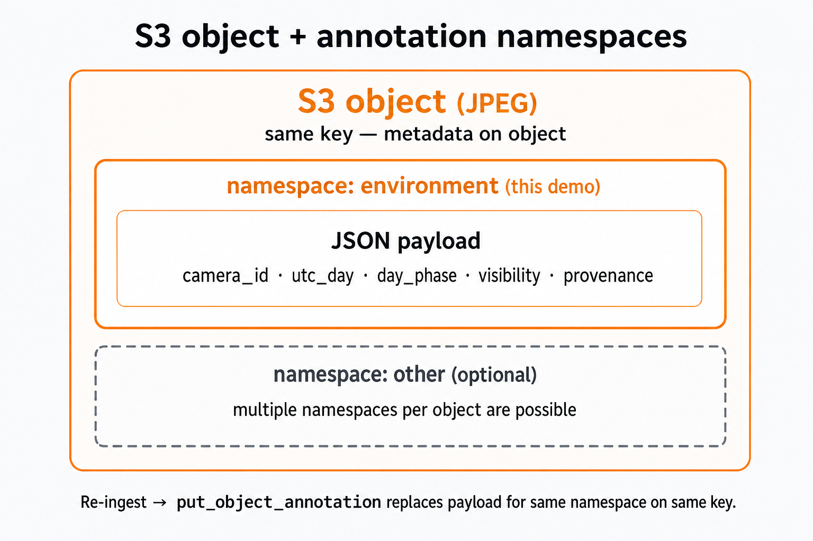
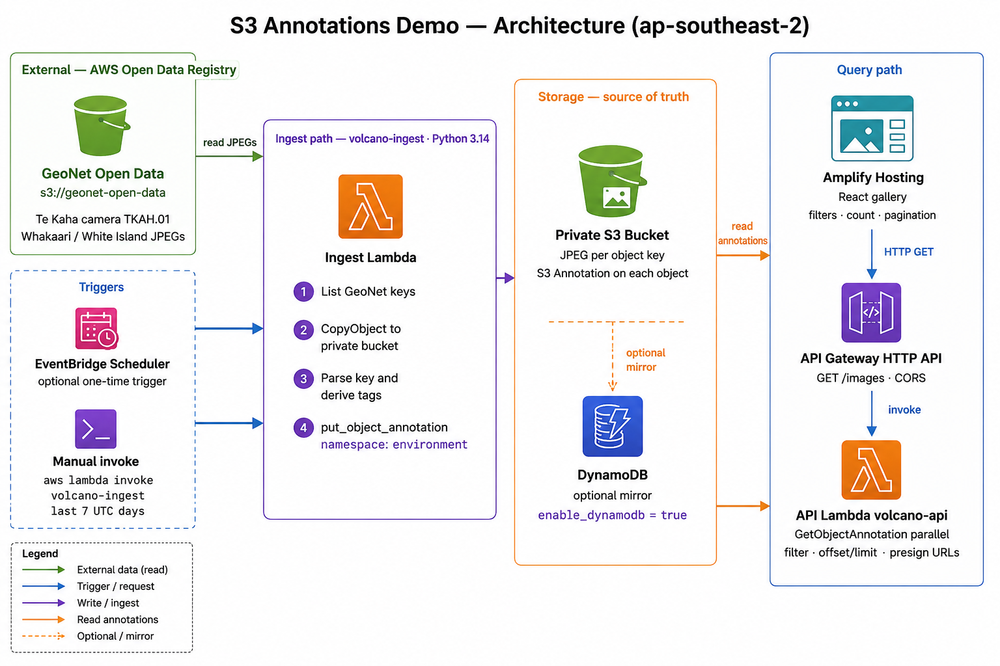
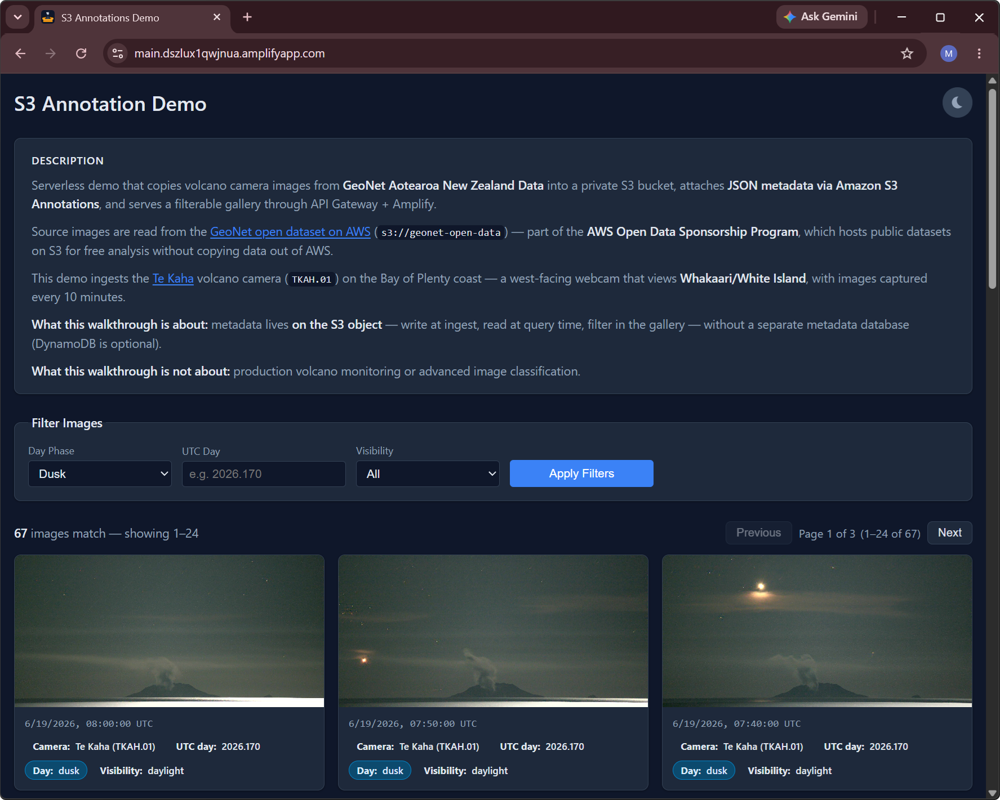

# S3 Annotations Walkthrough — Reference Guide

Serverless demo that copies volcano camera images from **[GeoNet Aotearoa New Zealand Data](https://registry.opendata.aws/geonet/)** into a private S3 bucket, attaches **JSON metadata via Amazon S3 Annotations**, and serves a filterable gallery through API Gateway + Amplify.

**Open data source:** images are read from `s3://geonet-open-data` via the [AWS Registry of Open Data — GeoNet](https://registry.opendata.aws/geonet/). The **AWS Open Data Sponsorship Program** hosts public datasets on S3 so you can analyze them in place without egress charges to copy data out of AWS.

**Camera:** [Te Kaha](https://www.geonet.org.nz/volcano/cameras/tekaha) (`TKAH.01`) — a west-facing webcam on the Bay of Plenty coast that views **Whakaari/White Island** (10-minute captures).

**What this walkthrough is about:** metadata lives **on the S3 object** — write at ingest, read at query time, filter in the gallery — without a separate metadata database (DynamoDB is optional).

**What this walkthrough is not about:** production volcano monitoring or advanced image classification.

---

## Table of contents

1. [The S3 Annotations story](#the-s3-annotations-story)
2. [Architecture](#architecture)
3. [Deploy and operate](#deploy-and-operate)
4. [Ingest: copy object + write annotation](#ingest-copy-object--write-annotation)
5. [Annotation payload](#annotation-payload)
6. [API: read annotations + presign images](#api-read-annotations--presign-images)
7. [Optional DynamoDB mirror](#optional-dynamodb-mirror)
8. [Gallery (Amplify)](#gallery-amplify)
9. [Presenter script](#presenter-script)
10. [File reference](#file-reference)

---

## The S3 Annotations story

Traditional pattern: image in S3, metadata in a database or sidecar index. **S3 Annotations** attach structured metadata directly to the object.

```text
S3 object (JPEG)
    └── annotation namespace "environment"
            └── JSON payload (camera, time, filters, provenance)
```

### Why this matters for the demo

| Idea | How the demo shows it |
|------|------------------------|
| Metadata travels with the object | Annotations are written on the same key as the JPEG |
| No extra DB required (default) | API reads `GetObjectAnnotation` per object |
| Filterable in apps | Gallery filters on annotation fields — **in application code**, not via a native S3 query |
| Provenance | `source_bucket`, `source_key`, `ingest_run_id` on every object |
| Lifecycle | `terraform destroy` removes bucket + annotations together |

### S3 Annotations in practice (for presenters)

#### No server-side query

S3 Annotations do **not** support “find all objects where `day_phase=dusk`.” There is no annotation search API across a bucket.

This demo instead:

1. **Lists object keys** in the private bucket (`ListObjectsV2`)
2. Calls **`GetObjectAnnotation`** per key (parallel in the API Lambda)
3. **Filters in Lambda** on the parsed JSON, then paginates

| Tradeoff | Detail |
|----------|--------|
| **Benefit** | Metadata travels with the object; no sidecar file or separate metadata DB required |
| **Cost** | Query and filter are **application work** — roughly *N objects → N annotation reads* per gallery/API request |
| **Scale pattern** | Optional **DynamoDB mirror** (`enable_dynamodb`) acts as a denormalized index; **S3 remains canonical** |

Say plainly: *annotations colocate metadata; they do not replace a query engine.*

#### Annotations vs other S3 metadata

| Approach | What it is | Why this demo uses annotations instead |
|----------|------------|----------------------------------------|
| **S3 object tags** | Up to 10 key/value pairs per object; string values; tag-based filtering APIs | Too small for structured JSON; not ideal for rich provenance + filter fields |
| **User metadata** (`PutObject` headers) | Key/value headers set at upload time | Awkward to update after copy; not the structured annotation workflow |
| **Sidecar files** | `image.jpg` + `image.json` as separate keys | Metadata can drift from the image; lifecycle and permissions are harder to keep aligned |
| **S3 Annotations** | Named namespace + payload blob on the **same object** | JSON metadata versioned with the asset; `put_object_annotation` / `get_object_annotation` API |

#### Namespaces



To see which namespaces exist on an object:

```bash
aws s3api list-object-annotations \
  --bucket "$BUCKET" \
  --key "$KEY"
```

#### API surface (demo vs full feature)

**Helpers:** `lambda/shared/s3_annotations.py` wraps boto3 ≥ 1.43.

| S3 API | In this demo? | In walkthrough / code |
|--------|---------------|------------------------|
| `PutObjectAnnotation` | Yes | Ingest Lambda — `put_object_annotation()` |
| `GetObjectAnnotation` | Yes | API Lambda — `get_object_annotation()` |
| `ListObjectAnnotations` | No | CLI example above; alternative to assuming every key has `environment` |
| `DeleteObjectAnnotation` | No | Not needed; `terraform destroy` removes objects + annotations |

#### IAM permissions

Annotation access is **explicit IAM** on the private bucket (`terraform/iam.tf`):

| Role | Actions | Purpose |
|------|---------|---------|
| Ingest Lambda | `s3:PutObject`, `s3:PutObjectAnnotation`, `s3:ListBucket` | Copy JPEG, write annotation |
| API Lambda | `s3:GetObject`, `s3:GetObjectAnnotation`, `s3:ListBucket` | Read annotation, presign image |

**Talking point:** reading or writing metadata requires the annotation IAM actions — not just `GetObject` / `PutObject`.

#### Platform limitations

Do not assume annotations work everywhere S3 does. AWS documents cases where annotations are **not supported**, including:

- S3 Inventory Reports
- S3 Storage Lens
- S3 File Gateway
- Amazon FSx
- S3 on Outposts
- S3 Express One Zone (directory buckets)

**Note:** This demo uses **API Gateway** to invoke Lambda; Lambda reads annotations via the S3 API. API Gateway does not expose S3 Annotations directly — your app code (here, the API Lambda) calls S3.

### Core API surface (boto3 ≥ 1.43)

| Operation | Function | Used by |
|-----------|----------|---------|
| Write | `put_object_annotation()` | Ingest Lambda |
| Read | `get_object_annotation()` | API Lambda |

**Namespace:** `environment` (set via `ANNOTATION_NAMESPACE` on ingest).

### Inspect an annotation (live demo)

After ingest, pick any object key from the private bucket. Run from the **repository root** (the directory that contains `terraform/`):

```bash
BUCKET=$(terraform -chdir=terraform output -raw private_bucket_name)
KEY="camera/volcano/images/2026/TKAH/TKAH.01/2026.170/2026.170.0800.00.TKAH.01.jpg"

# CLI writes the annotation payload to a file (streaming blob); metadata prints to stdout.
PAYLOAD=$(mktemp)
aws s3api get-object-annotation \
  --bucket "$BUCKET" \
  --key "$KEY" \
  --annotation-name environment \
  "$PAYLOAD" >/dev/null

python3 -m json.tool "$PAYLOAD"
rm -f "$PAYLOAD"
```

**Sample output** (Te Kaha image `2026.170.0800.00.TKAH.01.jpg` after ingest):

```json
{
    "schema_version": "1",
    "camera_id": "TKAH.01",
    "volcano_site": "TKAH",
    "utc_day": "2026.170",
    "captured_utc": "2026-06-19T08:00:00Z",
    "day_phase": "dusk",
    "visibility": "daylight",
    "model": "metadata-luminance-v1",
    "source_bucket": "geonet-open-data",
    "source_key": "camera/volcano/images/2026/TKAH/TKAH.01/2026.170/2026.170.0800.00.TKAH.01.jpg",
    "ingest_run_id": "49f52ccc-2b61-4e1b-91c0-04440e479686",
    "ingested_at": "2026-06-19T08:57:20Z",
    "updated_at": "2026-06-19T08:57:20Z"
}
```

In the S3 console: open the object → **Annotations** tab → namespace `environment`.

---

## Architecture



End-to-end flow in `ap-southeast-2`:

1. **Source** — [GeoNet Aotearoa New Zealand Data](https://registry.opendata.aws/geonet/) (`s3://geonet-open-data`) publishes Te Kaha volcano camera JPEGs on the AWS Open Data Registry (no account required to read).
2. **Ingest** — `volcano-ingest` Lambda lists the last **7 UTC days** of keys, copies each JPEG into a **private bucket**, derives simple tags from the key path and pixel brightness, and writes an **S3 Annotation** (`environment` namespace) on the same object.
3. **Store** — The private bucket is the **source of truth**: each JPEG carries its JSON metadata via S3 Annotations. An optional **DynamoDB** table mirrors annotation fields for faster reads at larger scale.
4. **Query** — `volcano-api` Lambda (behind API Gateway `GET /images`) reads annotations, applies filters (`day_phase`, `utc_day`, `visibility`), paginates with `offset` + `limit`, and returns presigned image URLs.
5. **Gallery** — Amplify-hosted React SPA calls the API, shows a result count, paginates, and renders tag chips from the same annotation JSON you see in the S3 console.

| Component | AWS service | Role |
|-----------|-------------|------|
| GeoNet open bucket | S3 (public) | Source JPEGs — `camera/volcano/images/.../TKAH/TKAH.01/...` |
| EventBridge Scheduler | EventBridge | Optional one-time ingest trigger (`enable_scheduler`) |
| Ingest Lambda | Lambda (Python 3.14) | Copy images, `put_object_annotation` |
| Private bucket | S3 | Images + annotations (canonical metadata) |
| DynamoDB | DynamoDB | Optional denormalized mirror (`enable_dynamodb`) |
| API Lambda | Lambda (Python 3.14) | `get_object_annotation`, filter, presign |
| HTTP API | API Gateway v2 | `GET /images` with CORS |
| Gallery | Amplify Hosting | React UI — filters, count, pagination |

**Data source prefix:** `camera/volcano/images/{YYYY}/TKAH/TKAH.01/{YYYY.DDD}/*.jpg`

**Outputs after apply:**

```bash
cd terraform
terraform output amplify_app_url
terraform output api_invoke_url
terraform output private_bucket_name
```

Or from the repository root: `terraform -chdir=terraform output amplify_app_url`

---

## Deploy and operate

### Prerequisites

- AWS account (S3, Lambda, API Gateway, Amplify, IAM; optional DynamoDB)
- Terraform ≥ 1.6, Node.js + npm, Python 3.14, AWS CLI, `pip3`, `zip`

### Apply

```bash
cd terraform
terraform init
terraform apply
```

Terraform builds and deploys the React app by default (`deploy_amplify_on_apply = true`).

### Manual ingest

```bash
aws lambda invoke \
  --function-name volcano-ingest \
  --payload '{}' \
  --cli-binary-format raw-in-base64-out \
  /tmp/ingest-result.json
```

Response body includes `images_copied`, `images_annotated`, `annotation_failures`, `date`.

### Teardown

```bash
cd terraform
terraform destroy -auto-approve
```

`force_destroy = true` on the private bucket empties objects (and their annotations) automatically.

### Key Terraform variables

| Variable | Default | Notes |
|----------|---------|-------|
| `enable_dynamodb` | `false` | Optional annotation mirror |
| `enable_scheduler` | `false` | One-time ingest schedule |
| `deploy_amplify_on_apply` | `true` | Build gallery after apply |
| `private_bucket_name` | `volcano-annotations-demo-private` | |

---

## Ingest: copy object + write annotation

**Lambda:** `volcano-ingest`  
**Code:** `lambda/ingest_annotate/handler.py`

Per image (over the **last 7 UTC days** by default, `INGEST_LOOKBACK_DAYS`):

1. List `.jpg` keys from GeoNet for each day in the lookback window
2. `PutObject` copy to private bucket (same key)
3. Parse key → `camera_id`, `utc_day`, `captured_utc`, …
4. Derive `day_phase` and `visibility` from clock + pixel brightness
5. **`put_object_annotation`** with namespace `environment`
6. Optionally mirror key fields to DynamoDB

Object key pattern:

```text
camera/volcano/images/{YYYY}/TKAH/TKAH.01/{YYYY.DDD}/{YYYY}.{DDD}.{HHmm}.{ss}.{camera_id}.jpg
```

Keys that fail parsing are copied but not annotated.

---

## Annotation payload

`schema_version` and `model` record which JSON shape and which ingest logic wrote the annotation — handy after you redeploy Lambda and re-ingest only some objects.

### Fields the gallery uses (four filterable tags)

| Field | Source | Example |
|-------|--------|---------|
| `camera_id` | Object key | `TKAH.01` |
| `utc_day` | Object key | `2026.170` |
| `day_phase` | Filename UTC + camera timezone | `dusk` |
| `visibility` | Pixel brightness | `daylight` |

`visibility` values: `daylight` · `low_light` · `night`

### Provenance and ops fields (stored, not emphasized in UI)

| Field | Purpose |
|-------|---------|
| `schema_version` | Payload shape version (`"1"`) |
| `model` | Ingest/classifier version (`metadata-luminance-v1`) |
| `volcano_site` | Site code from key |
| `captured_utc` | ISO 8601 from filename |
| `source_bucket` / `source_key` | GeoNet lineage |
| `ingest_run_id` | Groups one ingest invocation |
| `ingested_at` / `updated_at` | Write timestamps |

### Example JSON

Same payload shape as the [CLI sample above](#inspect-an-annotation-live-demo) (`get-object-annotation` on `2026.170.0800.00.TKAH.01.jpg`):

```json
{
  "schema_version": "1",
  "camera_id": "TKAH.01",
  "volcano_site": "TKAH",
  "utc_day": "2026.170",
  "captured_utc": "2026-06-19T08:00:00Z",
  "day_phase": "dusk",
  "visibility": "daylight",
  "model": "metadata-luminance-v1",
  "source_bucket": "geonet-open-data",
  "source_key": "camera/volcano/images/2026/TKAH/TKAH.01/2026.170/2026.170.0800.00.TKAH.01.jpg",
  "ingest_run_id": "49f52ccc-2b61-4e1b-91c0-04440e479686",
  "ingested_at": "2026-06-19T08:57:20Z",
  "updated_at": "2026-06-19T08:57:20Z"
}
```

Tags are intentionally simple and verifiable — the walkthrough focus is **annotate → store → query**, not ML accuracy.

---

## API: read annotations + presign images

**Endpoint:** `GET {api_invoke_url}/images`

### Query parameters

| Parameter | Values |
|-----------|--------|
| `day_phase` | `night`, `dawn`, `day`, `dusk` |
| `utc_day` | `YYYY.DDD` e.g. `2026.170` |
| `visibility` | `daylight`, `low_light`, `night` |
| `limit` | 1–200 (gallery uses 24 per page) |
| `offset` | Skip N matching results (pagination) |

Example:

```bash
API=$(terraform -chdir=terraform output -raw api_invoke_url)
curl -s "${API}/images?utc_day=2026.170&day_phase=dusk&limit=1" | python3 -m json.tool
```

### Response

**Sample output** (`utc_day=2026.170`, `day_phase=dusk`, `limit=1`):

```json
{
    "items": [
        {
            "key": "camera/volcano/images/2026/TKAH/TKAH.01/2026.170/2026.170.0800.00.TKAH.01.jpg",
            "tags": {
                "updated_at": "2026-06-19T08:57:20Z",
                "model": "metadata-luminance-v1",
                "camera_id": "TKAH.01",
                "day_phase": "dusk",
                "visibility": "daylight",
                "ingest_run_id": "49f52ccc-2b61-4e1b-91c0-04440e479686",
                "utc_day": "2026.170",
                "captured_utc": "2026-06-19T08:00:00Z",
                "volcano_site": "TKAH"
            },
            "image_url": "https://volcano-annotations-demo-private.s3.amazonaws.com/camera/volcano/images/2026/TKAH/TKAH.01/2026.170/2026.170.0800.00.TKAH.01.jpg?X-Amz-Algorithm=AWS4-HMAC-SHA256&X-Amz-Expires=900&..."
        }
    ],
    "total_available": 19,
    "offset": 0,
    "limit": 1
}
```

- **`tags`** — parsed S3 Annotation payload (subset of fields may appear depending on DynamoDB mirror vs S3 read path)
- **`image_url`** — presigned `GetObject`, expires in 900s (truncated above; your response includes full query params)
- **`total_available`** — full match count across all pages (`19` dusk images on UTC day `2026.170` at time of sample)
- **`offset`** / **`limit`** — pagination cursor for the gallery/API

### Default read path (no DynamoDB)

There is **no bucket-level annotation query** — the API implements search itself:

1. List object keys in private bucket
2. Fetch all matching annotations in parallel (`GetObjectAnnotation`)
3. Apply filters; sort by `captured_utc`
4. Slice page with `offset` + `limit`
5. Presign objects in the current page

Images always come from S3; annotations supply metadata only.

---

## Optional DynamoDB mirror

**Flag:** `enable_dynamodb = true` in `terraform.tfvars`

Because S3 Annotations have [no server-side query](#no-server-side-query), DynamoDB is an optional **read index** — not a replacement for canonical metadata on the object.

| | S3 Annotations (default) | + DynamoDB |
|--|--------------------------|------------|
| Source of truth | S3 | S3 |
| API read | Parallel `GetObjectAnnotation` | Table scan + filter |
| Best for | This walkthrough (~tens–hundreds of images) | Larger catalogs |

Ingest writes S3 Annotation first; DynamoDB is a denormalized copy. No backfill on enable — re-run ingest.

---

## Gallery (Amplify)

**URL:** `terraform output amplify_app_url`



1. Open gallery → optional filters (day phase, UTC day, visibility)
2. **Apply Filters** — loads annotations via API; summary shows **N images match**
3. Paginate with Previous / Next when results exceed 24 per page
4. Each card shows capture time + tag chips (Te Kaha camera, UTC day, day phase, visibility)
5. Click thumbnail for lightbox

The UI demonstrates **consumer reads annotation-backed metadata** — the same JSON you see in `get-object-annotation`.

Manual frontend deploy:

```bash
AMPLIFY_APP_ID=$(terraform -chdir=terraform output -raw amplify_app_id)
VITE_API_URL=$(terraform -chdir=terraform output -raw api_invoke_url)
./scripts/deploy-amplify.sh
```

---

## Presenter script

Suggested flow (~30–45 min), **S3 Annotations first**:

1. **Problem** — images in S3, metadata elsewhere; annotations colocate metadata with objects
2. **Tradeoff** — [no server-side query](#no-server-side-query); N reads + app-side filter; optional DynamoDB index
3. **Architecture** — ingest writes, API reads, gallery consumes (diagram)
4. **`terraform apply`** — show outputs (bucket, API URL, gallery URL)
5. **Ingest** — invoke Lambda; show `images_annotated` count
6. **S3 console** — open a JPEG → **Annotations** tab → show `environment` JSON
7. **CLI** — `aws s3api get-object-annotation` (command above); optional `list-object-annotations`
8. **API** — `curl /images?utc_day=...` — point out `tags` vs `image_url`
9. **Gallery** — Apply Filters; same fields as annotation JSON
10. **Optional** — [Annotations vs tags/sidecars](#annotations-vs-other-s3-metadata), [IAM](#iam-permissions), DynamoDB mirror for scale
11. **Teardown** — `terraform destroy`; annotations gone with bucket

**Talking point:** Re-ingest overwrites the annotation on the same object (`put_object_annotation`) — metadata version travels with the asset.

---

## File reference

| Path | Role |
|------|------|
| `lambda/shared/s3_annotations.py` | `put_object_annotation` / `get_object_annotation` |
| `terraform/iam.tf` | `s3:PutObjectAnnotation` / `s3:GetObjectAnnotation` IAM |
| `lambda/ingest_annotate/handler.py` | Copy + annotate |
| `lambda/api/handler.py` | Query annotations + presign |
| `terraform/` | Full stack (S3, Lambda, API GW, Amplify, optional DynamoDB) |
| `amplify/src/` | Gallery UI |
| `scripts/build-lambda-packages.sh` | Lambda zip build (boto3 ≥ 1.43) |
| `docs/walkthrough.md` | Presenter guide (architecture PNG, CLI/API samples) |
| `docs/architecture.png` | Architecture diagram |
| `docs/namespaces.png` | Annotation namespaces diagram |
| `docs/webapp.png` | Gallery screenshot |
| `samples/volcano/` | Local reference JPEGs |
| `README.md` | Quick start |

---

## Build notes

- **boto3 ≥ 1.43** required for S3 Annotations API (bundled into Lambda zips on apply)
- **Pillow** used only for `visibility` brightness
- **Lambda runtime:** `python3.14` (see `terraform/lambda.tf`)
- **Local tests:** use `python3.14` — see `.python-version`

```bash
python3.14 -m venv .venv
source .venv/bin/activate
pip install -r requirements-dev.txt
pytest tests/ -v
```
